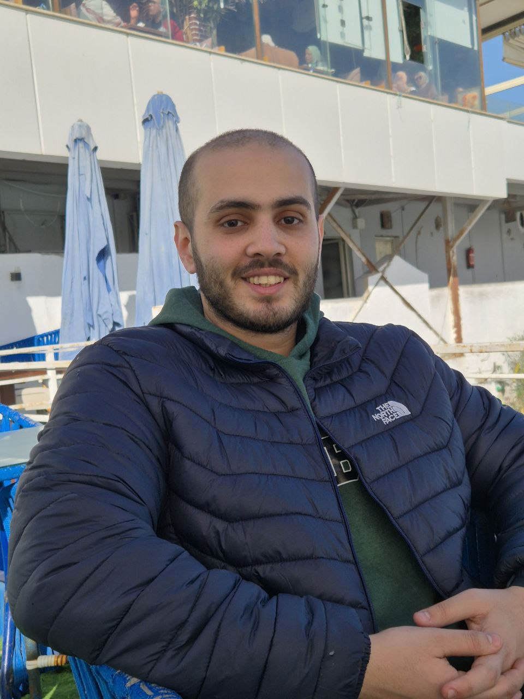

  
  

Engineer specializing in database systems, machine learning inference, parallel computing, and low-level systems optimization. I graduated with a B.Sc. in Computer and Communication Engineering from Alexandria University.

Previously, I was an Applied Scientist at Microsoft, where I worked on the NLP inference engine powering SwiftKey, Windows, and Samsung keyboards — adapting it for GPT-2–based models and optimizing inference latency. Before that, I interned at Siemens working on AUTOSAR-compliant embedded systems and at ITTIA building database optimization tools and analytics dashboards. I also worked on HPC seismic data processing at Brightskies.

  

[esalama057@proton.me](mailto:esalama057@proton.me) | [LinkedIn](https://linkedin.com/in/esalama) | [GitHub](https://github.com/izarrios)

---

## Experience

**GenAI Engineer** |  EnergyAI Berlin — Berlin, Germany | Aug 2025 – Feb 2026

- Designed and deployed multi-agent GenAI systems, orchestrating specialized agents to automate complex, multi-step workflows
- Built and managed end-to-end data pipelines to support model fine-tuning and RAG solutions

**Applied Scientist** |  Microsoft — Cairo, Egypt | Jul 2024 – Aug 2025

- Worked on the NLP inference engine powering SwiftKey, Windows, Samsung keyboard and other partners (C++)
- Adapted the engine for GPT-2–based models, extending support to modern transformer architectures
- Contributed in the implementation of the ghost typing feature on the engine
- Conducted benchmarking of engine and model integration (quality and performance) across multiple platforms, identifying and resolving critical performance bottlenecks, resulting in a 15% reduction in inference latency
- Developed a tool for evaluating and optimizing engine by searching with various strategies and hyperparameters to assess inference engine performance and accuracy, improving en\_US locale predictions accuracy by 5%

**Software Engineer Intern** |  Siemens — Cairo, Egypt | Sep 2023 – Jul 2024

- Developed and integrated a CAN communication stack compliant with AUTOSAR standards, including message parsing, transmission scheduling, and error handling (C/C++)
- Implemented a bootloader in Embedded C with Firmware Over-The-Air (FOTA), reducing update deployment time by 50%
- Designed and deployed real-time tasks on OSEK/VDX OS, optimizing system performance and reliability, leading to a 10% improvement in task execution efficiency

**Software Engineer (Part-time)** |  ITTIA — Bellevue, USA | Oct 2023 – Jul 2024

- Implemented database optimization algorithms resulting in 30% query performance improvement (C/C++)
- Led the development of a new UI tool used for users to interact with dashboards which included multiple system/database analytics, increasing user engagement by 25% (React, Typescript)
- Increased test coverage by 30% across multiple components of the product
- Identified and resolved several critical performance bottlenecks on various embedded devices and platforms, such as optimizing memory usage on ARM Cortex-M microcontrollers and reducing boot times on IoT gateways

**High Performance Computing Intern** |  Brightskies — Alexandria, Egypt | Jul 2023 – Sep 2023

- Worked on an internal seismic data processor in supporting multiple industry formats, supporting parallel I/O and CUDA computations for large-scale geophysical datasets (C++, CUDA)
- Developed a user-friendly command-line interface to encapsulate and simplify usage of an internal library, improving team productivity

---

## Education

**Bachelor of Science, Computer and Communication Engineering** | Alexandria University — Alexandria, Egypt | Sep 2019 – Jul 2024

---

## Open Source Contributions

  
  
  
  
  

---

## Skills

C++, PyTorch, Machine Learning, Artificial Intelligence, CUDA, Triton, Python, Go, Rust, C, OMP, ONNX Runtime, MPI, Make, CMake, Ninja, Scons, Java, Scala, Docker, Git, Typescript, React

